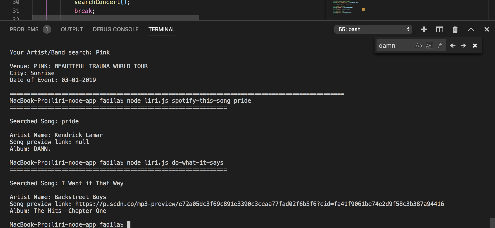

####### Liri-Node-App

#This App cannot be deployed to GitHub pages or Heroku, as this is a CLI App.

LIRI will search Spotify for songs, Bands in Town for concerts, and OMDB for movies.
Make a new GitHub repository called liri-node-app and clone it to your computer.
To retrieve the data that will power this app, you'll need to send requests using the axios package to the Bands in Town, Spotify and OMDB APIs. You'll find these Node packages crucial for your assignment.

#Node-Spotify-API

#Axios

You'll use Axios to grab data from the OMDB API and the Bands In Town API

#Moment
#DotEnv

Include screenshots (or a GIF/Video) of the typical user flow of your application. Make sure to include the use of Spotify, Bands in Town, and OMDB.
Include any other screenshots you deem necessary to help someone who has never been introduced to your application understand the purpose and function of it. This is how you will communicate to potential employers/other developers in the future what you built and why, and to show how it works.
Because screenshots (and well-written READMEs) are extremely important in the context of GitHub, this will be part of the grading.

If you haven't written a markdown file yet, click here for a rundown, or just take a look at the raw file of these instructions.

https://fbdel.github.io/liri-node-app/

################################
################################

####### Liri Bot App

#This App cannot be deployed to GitHub pages or Heroku, as this is a CLI App. Screenshots included at the bottom of page, with the results of the 4 functions.

###Overview

LIRI is like iPhone's SIRI. However, while SIRI is a Speech Interpretation and Recognition Interface, LIRI is a Language Interpretation and Recognition Interface. LIRI will be a command line node app that takes in parameters and gives you back data.

###How It Works 

**API's Used** 
-Spotify for songs
-Bands in Town for concerts
-and OMDB for movies.

Utilizing *Axios* package to the Bands in Town, Spotify and OMDB APIs. 

**Node Packages Used**

-Node-Spotify-API  

-Axios

-Moment

-DotEnv

###Function 

**Liri.js takes in  two arguments:**

First, one of the following commands:

-concert-this
-spotify-this-song
-movie-this
-do-what-it-says

Second, a value relating to the first if anything at all.

###What Each Command Should Do

**Concert-this**

-This will search the Bands in Town Artist Events API for an artist and render the following information about each event to the terminal:

    * Name of the venue
    * Venue location
    * Date of the Event (use moment to format this as "MM/DD/YYYY")

**Spotify-this-song**

-This renders the following information about the song in terminal/bash window

    * Artist(s)
    * The song's name
    * A preview link of the song from Spotify
    * The album that the song is from

    * If no song is provided the default song is "The Sign" by Ace of Base.

**Movie-this**

-This function will render the following information to the terminal/bash window:

   * Title of the movie.
   * Year the movie came out.
   * IMDB Rating of the movie.
   * Rotten Tomatoes Rating of the movie.
   * Country where the movie was produced.
   * Language of the movie.
   * Plot of the movie.
   * Actors in the movie.

    * Default movie rendered in the event no second argument is inserted 'Mr. Nobody', along with a printed message.

**Do-what-it-says**

    * File random.text is read, then the content from the file are set as the two arguments used required to execute the switchTask function 

######Links

[Liri Bot Link](https://fbdel.github.io/liri-node-app/)